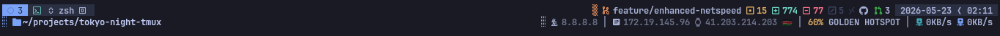

# Tokyo Night Tmux

A clean, dark Tmux theme inspired by the lights of [Tokyo at night](https://www.google.com/search?q=tokyo+night&tbm=isch).
Adapted from the [Tokyo Night VS Code theme](https://github.com/enkia/tokyo-night-vscode-theme) — the perfect companion for [tokyonight-vim](https://github.com/ghifarit53/tokyonight-vim).

---

## Preview

> Terminal: [Kitty](https://github.com/davidmathers/tokyo-night-kitty-theme) · Font: [SFMono Nerd Font Ligaturized](https://github.com/shaunsingh/SFMono-Nerd-Font-Ligaturized)


*Default status bar*


*Second status bar with path, netspeed, and music widgets*


*Path widget showing directories with spaces*

---

## Quick start

### 1. Install dependencies

**Nerd Fonts v3+** and **Bash 4.2+** are required.

<details>
<summary>macOS</summary>

```bash
brew install --cask font-monaspace-nerd-font font-noto-sans-symbols-2
brew install bash bc coreutils gawk gh glab gsed jq nowplaying-cli
```

</details>

<details>
<summary>Arch Linux</summary>

```bash
pacman -Sy bash bc coreutils git jq playerctl
```

</details>

<details>
<summary>Ubuntu / Debian</summary>

```bash
apt-get install bash bc coreutils gawk git jq playerctl
```

</details>

<details>
<summary>Alpine Linux</summary>

```bash
apk add bash bc coreutils gawk git jq playerctl sed
```

</details>

→ Full dependency list: [user_docs/installation.md](user_docs/installation.md)

### 2. Install the plugin via TPM

Add to `~/.tmux.conf` and press `prefix` + <kbd>I</kbd> to install:

```bash
set -g @plugin "den-tanui/tokyo-night-tmux"
```

### 3. Pick a theme *(optional)*

```bash
set -g @tokyo-night-tmux_theme night   # night (default) | storm | moon | day
set -g @tokyo-night-tmux_transparent 1 # transparent background
```

### 4. Enable and reorder widgets

Configure which widgets appear and in what order. Being in a widget list
**auto-enables** the widget — no need for individual `_show_*` flags.

```bash
# Main bar (right side)
set -g @tokyo-night-tmux_show_right_widgets "battery,git,datetime"

# Second status bar (tmux ≥ 3.2 — auto-enabled when these options are set)
set -g @tokyo-night-tmux_show_second_left_widgets "path"
set -g @tokyo-night-tmux_show_second_right_widgets "music,netspeed"
```

Reload: `tmux source ~/.tmux.conf`

You can also inject arbitrary tmux commands, format variables, or attributes anywhere in the list:

```bash
set -g @tokyo-night-tmux_show_right_widgets "path,git,#(curl -s http://localhost/status | head -c 40),datetime"
```

### Alternative: per-widget toggles

You can still use the traditional `_show_<name>` flags if you prefer:

```bash
set -g @tokyo-night-tmux_show_git 1
set -g @tokyo-night-tmux_show_netspeed 1
set -g @tokyo-night-tmux_show_battery_widget 1
set -g @tokyo-night-tmux_show_music 1
set -g @tokyo-night-tmux_show_datetime 1
```

---

## Features

| Feature | Description |
|---|---|
| 4 color themes | Night, Storm, Moon, Day — plus transparent background |
| **Widget reordering** | Customize widget order and position via comma-separated lists |
| **Second status bar** | Dedicated row for path, netspeed, music, etc. (tmux ≥ 3.2) |
| **Auto-enable by order** | Listing a widget in your config implicitly enables it |
| Local git status | Branch, changes, push/pull sync indicator |
| GitHub / GitLab widget | Open PRs, pending reviews, assigned issues |
| Netspeed | Upload/download speed with Wi-Fi signal (%) and interface detection |
| Signal strength | Color-coded percentage (red/yellow/green) |
| Now Playing | Track info via playerctl (Linux) or nowplaying-cli (macOS) |
| Battery | Level and charge state with contextual icons |
| Date & Time | Configurable format (YMD/MDY/DMY, 12H/24H) |
| Path widget | Current pane path (relative or absolute) |
| Hostname | Machine hostname in the status bar |
| Number styles | 8 styles for window/pane IDs (digital, roman, squares, …) |
| SSH indicator | Automatic icon change for SSH sessions |
| Prefix highlight | Visual indicator when tmux prefix is active |
| Zoom indicator | Separate style for zoomed panes |

---

## Configuration reference

All options are set via `set -g @tokyo-night-tmux_<key> <value>` in `~/.tmux.conf`.
Reload with `tmux source ~/.tmux.conf`.

### Status bar layout

| Option | Values | Default | Description |
|--------|--------|---------|-------------|
| `show_right_widgets` | comma-separated widget names | *(upstream fallback)* | Main bar widget order |
| `show_second_status` | `0`, `1` | auto | Force second status bar off (`0`) |
| `show_second_left_widgets` | comma-separated widget names | `path` | Second bar left side (auto-enables bar) |
| `show_second_right_widgets` | comma-separated widget names | `netspeed` | Second bar right side (auto-enables bar) |

**Available widget names:** `battery`, `path`, `music`, `netspeed`, `git`, `wbg`, `datetime`, `date`, `time`, `hostname`.
Passthrough entries (`#()`, `#{}`, `#[]`) are injected verbatim.
Being in any order list **auto-enables** the widget. Set `_show_<name> 0` to hard opt-out.

### Per-widget toggles

| Option | Default |
|--------|---------|
| `show_git` | off |
| `show_wbg` | off |
| `show_netspeed` | off |
| `show_battery_widget` | off |
| `show_music` | off |
| `show_path` | off |
| `show_hostname` | off |
| `show_datetime` | off |
| `show_date` | off |
| `show_time` | off |

### Widget detail options

| Widget | Option | Values | Default | Description |
|--------|--------|--------|---------|-------------|
| **Netspeed** | `netspeed_iface` | interface name | auto-detected | Network interface to monitor |
| | `netspeed_showip` | `off`, `local`, `public`, `both` | `local` | IP address display mode |
| | `netspeed_show_country` | `0`, `1` | `1` | Country flag next to public IP |
| | `netspeed_show_dns` | `0`, `1` | `0` | Active DNS server |
| | `netspeed_refresh` | seconds | `1` | Speed sample interval |
| | `netspeed_ip_refresh_rate` | seconds | `300` | Public IP fetch interval |
| | `netspeed_signal_refresh_rate` | seconds | `10` | SSID/signal re-sample interval |
| **Battery** | `battery_name` | battery name | `BAT1` / `InternalBattery-0` | Power supply device |
| | `battery_low_threshold` | 0–100 | `21` | Warning threshold % |
| **Date & Time** | `date_format` | `YMD`, `MDY`, `DMY`, `hide` | system default | Date display format |
| | `time_format` | `12H`, `24H`, `hide` | `24H` | Time display format |
| **Path** | `path_format` | `relative`, `full` | `relative` | Path display style |

### Theme & appearance

| Option | Values | Default | Description |
|--------|--------|---------|-------------|
| `theme` | `night`, `storm`, `moon`, `day` | `night` | Color palette |
| `transparent` | `0`, `1` | `0` | Transparent background |
| `window_id_style` | `digital`, `roman`, `fsquare`, `hsquare`, `dsquare`, `super`, `sub`, `none`, `hide` | `digital` | Window number style |
| `pane_id_style` | same as above | `hsquare` | Pane number style |
| `zoom_id_style` | same as above | `dsquare` | Zoomed pane number style |
| `terminal_icon` | any glyph | `` | Inactive window icon |
| `active_terminal_icon` | any glyph | `` | Active window icon |
| `window_tidy_icons` | `0`, `1` | `0` | Remove extra space between icons |

### Hard opt-out

`set -g @tokyo-night-tmux_show_<name> 0` disables a widget everywhere, even if
it appears in a widget order list.

---

## Documentation

| Topic | Link |
|---|---|
| Installation & dependencies | [user_docs/installation.md](user_docs/installation.md) |
| Color themes & transparency | [user_docs/themes.md](user_docs/themes.md) |
| Widget ordering & status bar | [user_docs/widgets.md](user_docs/widgets.md) |
| Number styles & window icons | [user_docs/customization.md](user_docs/customization.md) |

---

## Contributing

> [!IMPORTANT]
> This is a personal fork — changes here may diverge significantly from the
> upstream. PRs are welcome, but expect a different feature set.

Feel free to open an issue or pull request with suggestions or improvements.
Ensure your editor follows `.editorconfig`.

[Nerd Fonts]: https://www.nerdfonts.com/
[bc]: https://www.gnu.org/software/bc/
[jq]: https://jqlang.github.io/jq/
[playerctl]: https://github.com/altdesktop/playerctl
[nowplaying-cli]: https://github.com/kirtan-shah/nowplaying-cli
[Homebrew]: https://brew.sh/
